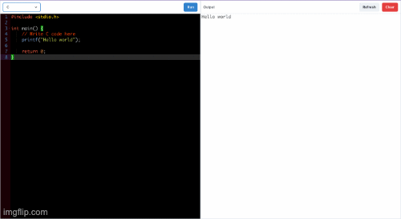
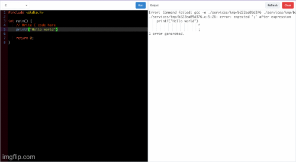

# code-editor-online
This code editor supports 4 languages - ```C```, ```C++```, ```Javascript```, ```Python```. Backend is developed using ```NodeJS```.

Concept of ```child_process``` is used to execute the codes of the languages.

# Output


# Error Handling

